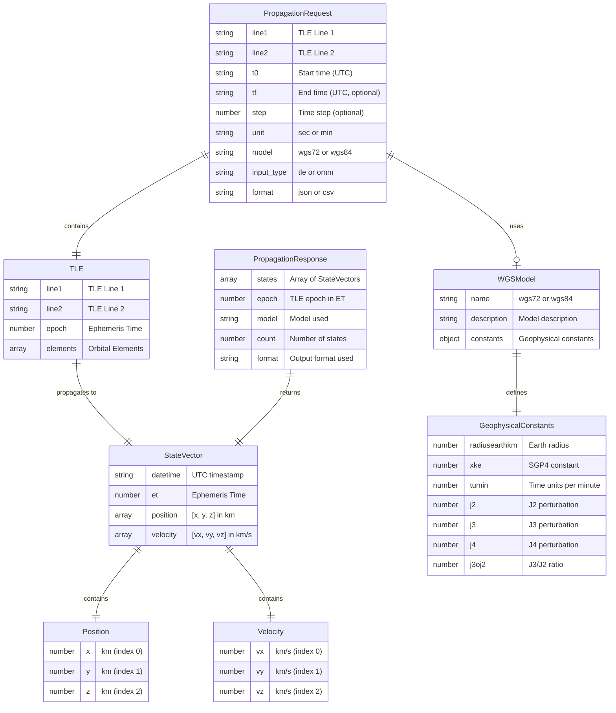
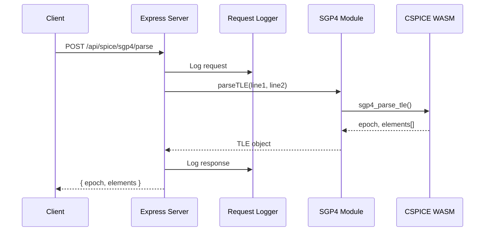
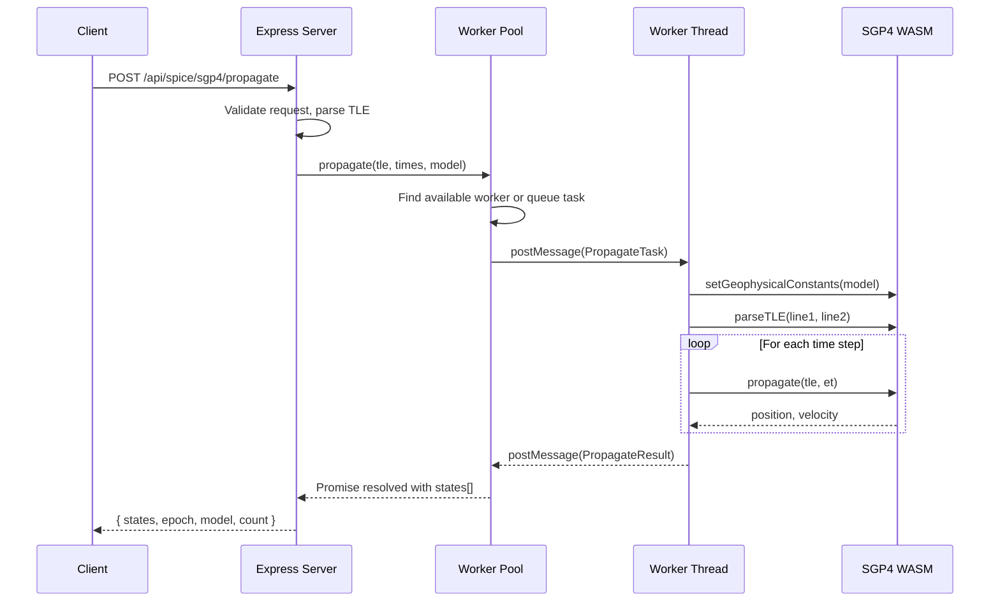
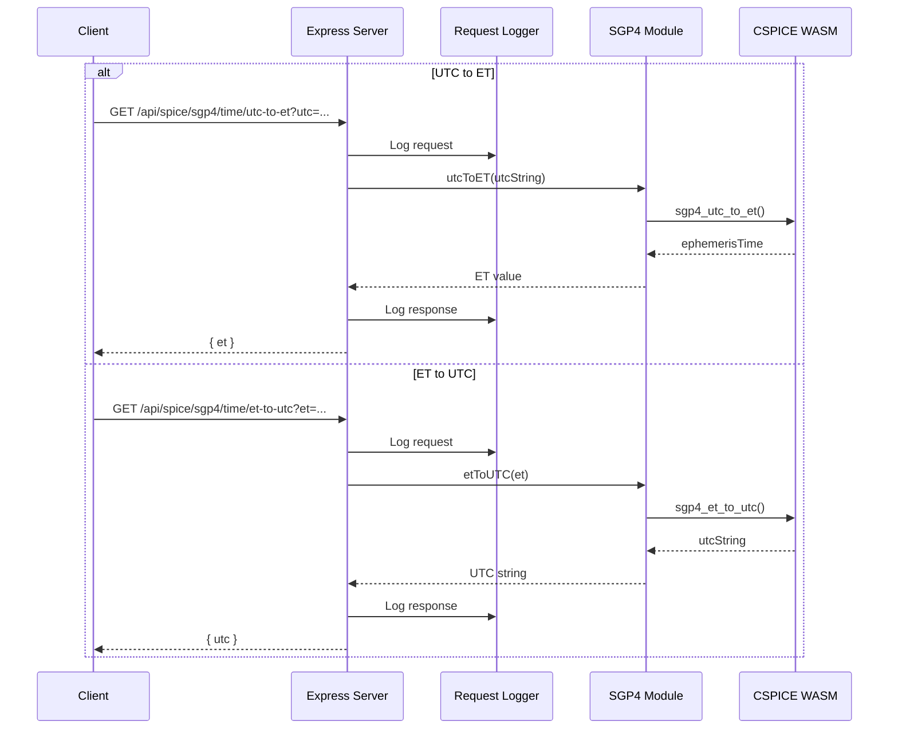
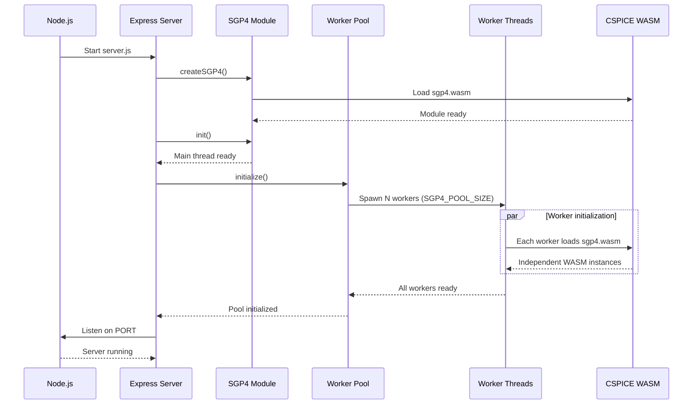
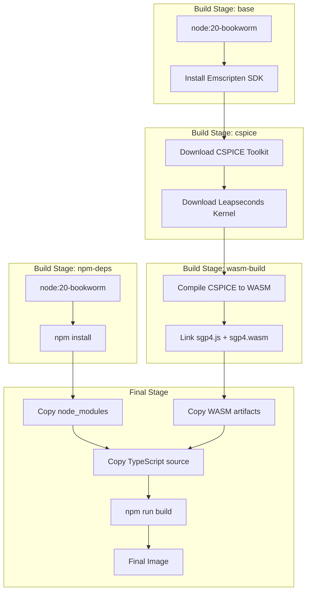

# SPICE SGP4 Architecture

## Overview

SPICE SGP4 is a REST API service that provides satellite orbit propagation using the SGP4 algorithm. Two implementations are available:

- **WASM Server** (port 50000): CSPICE compiled to WebAssembly - portable, runs anywhere
- **Native Server** (port 50001): SIMD-optimized native add-on - maximum performance

## Dual-Server Architecture

```
┌─────────────────────────────────────────────────────────────────────────────┐
│                              Client                                          │
│                   (Browser, curl, Application)                               │
└─────────────────────────────────────────────────────────────────────────────┘
                    │                               │
                    ▼                               ▼
┌───────────────────────────────────┐ ┌───────────────────────────────────────┐
│     WASM Server (port 50000)      │ │     Native Server (port 50001)        │
│  ┌─────────────────────────────┐  │ │  ┌─────────────────────────────────┐  │
│  │     Express.js + Workers    │  │ │  │     Express.js + Workers        │  │
│  └─────────────────────────────┘  │ │  └─────────────────────────────────┘  │
│              │                    │ │              │                        │
│  ┌───────────┼───────────┐       │ │  ┌───────────┼───────────┐            │
│  ▼           ▼           ▼       │ │  ▼           ▼           ▼            │
│ ┌────┐     ┌────┐     ┌────┐     │ │ ┌────┐     ┌────┐     ┌────┐         │
│ │WASM│     │WASM│     │WASM│     │ │ │SIMD│     │SIMD│     │SIMD│         │
│ │64MB│     │64MB│     │64MB│     │ │ │ C  │     │ C  │     │ C  │         │
│ └────┘     └────┘     └────┘     │ │ └────┘     └────┘     └────┘         │
│                                   │ │                                       │
│  ~750K prop/s                     │ │  ~5-10M prop/s (Docker)               │
│                                   │ │  ~55M prop/s (Host ARM NEON)          │
└───────────────────────────────────┘ └───────────────────────────────────────┘
```

### Implementation Comparison

| Aspect | WASM Server | Native Server |
|--------|-------------|---------------|
| Port | 50000 | 50001 |
| Implementation | CSPICE → WebAssembly | C + SIMD (AVX2/NEON) |
| Portability | Any platform | Platform-specific binary |
| Performance | ~750K prop/s | ~5-55M prop/s |
| Memory per worker | ~64MB | ~1MB |
| Build dependency | Emscripten | node-gyp |

## System Architecture (WASM Server)

```
┌─────────────────────────────────────────────────────────────────┐
│                         Client                                  │
│              (Browser, curl, Application)                       │
└─────────────────────────────────────────────────────────────────┘
                              │
                              ▼
┌─────────────────────────────────────────────────────────────────┐
│                    Express.js Server (Main Thread)              │
│  ┌───────────────┐  ┌───────────────┐  ┌───────────────┐       │
│  │  Compression  │  │ Request Logger│  │  Swagger UI   │       │
│  │    (gzip)     │  │               │  │               │       │
│  └───────────────┘  └───────────────┘  └───────────────┘       │
│  ┌───────────────┐  ┌───────────────┐  ┌───────────────┐       │
│  │  API Routes   │  │  HTTP Cache   │  │  Worker Pool  │       │
│  │               │  │ (ETag/304)    │  │   Manager     │       │
│  └───────────────┘  └───────────────┘  └───────────────┘       │
└─────────────────────────────────────────────────────────────────┘
                              │
            ┌─────────────────┼─────────────────┐
            │                 │                 │
            ▼                 ▼                 ▼
┌───────────────┐   ┌───────────────┐   ┌───────────────┐
│   Worker 1    │   │   Worker 2    │   │   Worker N    │
│  ┌─────────┐  │   │  ┌─────────┐  │   │  ┌─────────┐  │
│  │  SGP4   │  │   │  │  SGP4   │  │   │  │  SGP4   │  │
│  │  WASM   │  │   │  │  WASM   │  │   │  │  WASM   │  │
│  │  64MB   │  │   │  │  64MB   │  │   │  │  64MB   │  │
│  └─────────┘  │   │  └─────────┘  │   │  └─────────┘  │
└───────────────┘   └───────────────┘   └───────────────┘
  (independent)       (independent)       (independent)
```

## Worker Pool Architecture

The server uses Node.js `worker_threads` to parallelize SGP4 propagation requests. Each worker has its own independent WASM instance, eliminating race conditions and enabling multi-core utilization.

```
┌─────────────────────────────────────────────────────────────────┐
│                     Main Thread                                  │
│  ┌──────────┐    ┌────────────────┐    ┌─────────────────┐      │
│  │ Express  │───▶│  Worker Pool   │───▶│  Task Queue     │      │
│  │ Server   │    │  Manager       │    │  (pending)      │      │
│  └──────────┘    └────────────────┘    └─────────────────┘      │
│                         │                                        │
└─────────────────────────┼────────────────────────────────────────┘
                          │ postMessage / on('message')
    ┌─────────────────────┼─────────────────────┐
    ▼                     ▼                     ▼
┌─────────┐         ┌─────────┐         ┌─────────┐
│ Worker 1│         │ Worker 2│         │ Worker N│
│ ┌─────┐ │         │ ┌─────┐ │         │ ┌─────┐ │
│ │SGP4 │ │         │ │SGP4 │ │         │ │SGP4 │ │
│ │WASM │ │         │ │WASM │ │         │ │WASM │ │
│ │64MB │ │         │ │64MB │ │         │ │64MB │ │
│ └─────┘ │         │ └─────┘ │         │ └─────┘ │
└─────────┘         └─────────┘         └─────────┘
```

### Benefits

| Aspect | Single-threaded | Worker Pool |
|--------|-----------------|-------------|
| Concurrency | Sequential | N workers (CPU cores) |
| Race conditions | Possible | Eliminated |
| Request isolation | Shared state | Per-worker state |
| Memory | ~64MB | ~64MB × N workers |
| Throughput | ~50-100 req/s | ~500 req/s |

### Configuration

The pool size is configurable via environment variable:

```yaml
# compose.yaml
environment:
  - SGP4_POOL_SIZE=${SGP4_POOL_SIZE:-12}
```

Optimal concurrency: `PARALLEL = 2 × SGP4_POOL_SIZE`

## Entity Relationship Diagram



## Sequence Diagrams

### TLE Parse Flow



### TLE Propagation Flow (Worker Pool)



**Key Points:**

- Each worker has its own isolated WASM instance
- Workers set geophysical constants independently (no race conditions)
- Task queue handles back-pressure when all workers are busy
- Results are streamed back via message passing

### Time Conversion Flow



### Server Initialization Flow



## API Endpoints

| Method | Endpoint | Description |
|--------|----------|-------------|
| POST | `/api/spice/sgp4/parse` | Parse TLE and return orbital elements |
| POST | `/api/spice/sgp4/propagate` | Propagate TLE/OMM (supports JSON/CSV output) |
| POST | `/api/spice/sgp4/omm/parse` | Parse OMM JSON and return orbital elements |
| POST | `/api/spice/sgp4/omm/to-tle` | Convert OMM to TLE format |
| POST | `/api/spice/sgp4/tle/to-omm` | Convert TLE to OMM format |
| GET | `/api/spice/sgp4/time/utc-to-et` | Convert UTC to Ephemeris Time |
| GET | `/api/spice/sgp4/time/et-to-utc` | Convert Ephemeris Time to UTC |
| GET | `/api/spice/sgp4/health` | Health check endpoint |
| GET | `/api/spice/sgp4/pool/stats` | Worker pool statistics |
| GET | `/api/models/` | List available geophysical models |
| GET | `/api/models/wgs/:name` | Get specific WGS model details |
| GET | `/api/docs` | Interactive Swagger UI documentation |
| GET | `/api/openapi.json` | OpenAPI specification |

### Propagate Query Parameters

| Parameter | Values | Default | Description |
|-----------|--------|---------|-------------|
| `t0` | UTC string | (required) | Start time |
| `tf` | UTC string | - | End time (for range mode) |
| `step` | number | - | Time step (for range mode) |
| `unit` | `sec`, `min` | `sec` | Step unit |
| `wgs` | `wgs72`, `wgs84` | `wgs72` | Geophysical model |
| `input_type` | `tle`, `omm` | `tle` | Input format |
| `output_type` | `json`, `txt` | `txt` | Output format |
| `batch_size` | 1-1209602 | 1209 | Rows per batch (txt only) |

**Limits:** Maximum of 1,209,602 points per request (14 days at 1-second resolution).

### Output Formats

**TXT format** (default, `output_type=txt`):

```
datetime,et,x,y,z,vx,vy,vz
2024-01-15T12:00:00.000,758592069.18,-5945.93,-3284.80,0.29,2.31,-4.16,6.01
```

**JSON format** (`output_type=json`):

```json
{
  "states": [
    {
      "datetime": "2024-01-15T12:00:00.000",
      "et": 758592069.18,
      "position": [-5945.93, -3284.80, 0.29],
      "velocity": [2.31, -4.16, 6.01]
    }
  ],
  "epoch": 758592069.18,
  "model": "wgs72",
  "count": 1
}
```

## Performance Optimizations

### Worker Pool Parallelization

The server uses a pool of worker threads to parallelize SGP4 propagation requests:

- **Multi-core utilization**: N workers process requests concurrently (default: 12)
- **Isolated WASM instances**: Each worker has independent state, eliminating race conditions
- **Task queue**: Handles back-pressure when all workers are busy
- **Throughput**: ~500 req/s with optimal configuration (vs ~50-100 req/s single-threaded)

```bash
# Check pool statistics
curl http://localhost:50000/api/spice/sgp4/pool/stats
# {"poolSize":12,"busyWorkers":0,"availableWorkers":12,"queueLength":0,"pendingTasks":0}
```

### Response Compression

All responses are automatically compressed using gzip via the `compression` middleware, reducing transfer sizes by 60-80% for typical payloads.

### HTTP Caching

The propagate endpoint implements HTTP caching:

- **ETag**: Generated from request parameters (t0, tf, step, unit, model, body)
- **Cache-Control**: `public, max-age=3600` (1 hour)
- **304 Not Modified**: Returned when client sends matching `If-None-Match` header

```
Client Request:
If-None-Match: "abc123..."

Server Response (cache hit):
HTTP/1.1 304 Not Modified
```

### JSON Streaming

Large JSON responses are streamed incrementally using `res.write()` for O(1) memory usage instead of buffering the entire response:

```
res.write('{"states":[')
for each state:
    res.write(JSON.stringify(state))
res.write('],"metadata":...}')
res.end()
```

This prevents memory exhaustion when returning up to 1.2 million state vectors.

### TXT Batching

TXT output uses configurable batch sizes (default: 1,209 rows per flush) to balance memory usage with I/O efficiency.

## Container Architecture



## CI/CD Pipeline

### GitHub Actions

| Workflow | Concurrency | Description |
|----------|-------------|-------------|
| CI | `cancel-in-progress: true` | New commits cancel old test runs for faster feedback |
| Publish | `cancel-in-progress: false` | Builds queue to prevent partial deployments |

### GitLab CI

| Job | Interruptible | Description |
|-----|---------------|-------------|
| build | `true` | Can be cancelled by newer pipelines |
| test:unit | `true` | Can be cancelled by newer pipelines |
| test:api | `true` | Can be cancelled by newer pipelines |
| publish | `false` | Completes to prevent partial deployments |

## Data Flow

```
┌──────────┐     ┌──────────┐     ┌──────────┐     ┌──────────┐
│   TLE    │────▶│  Parse   │────▶│ Propagate│────▶│  State   │
│  Input   │     │          │     │          │     │  Vector  │
└──────────┘     └──────────┘     └──────────┘     └──────────┘
                      │                │
                      ▼                ▼
                ┌──────────┐     ┌──────────┐
                │  Epoch   │     │   WGS    │
                │   (ET)   │     │  Model   │
                └──────────┘     └──────────┘
```
