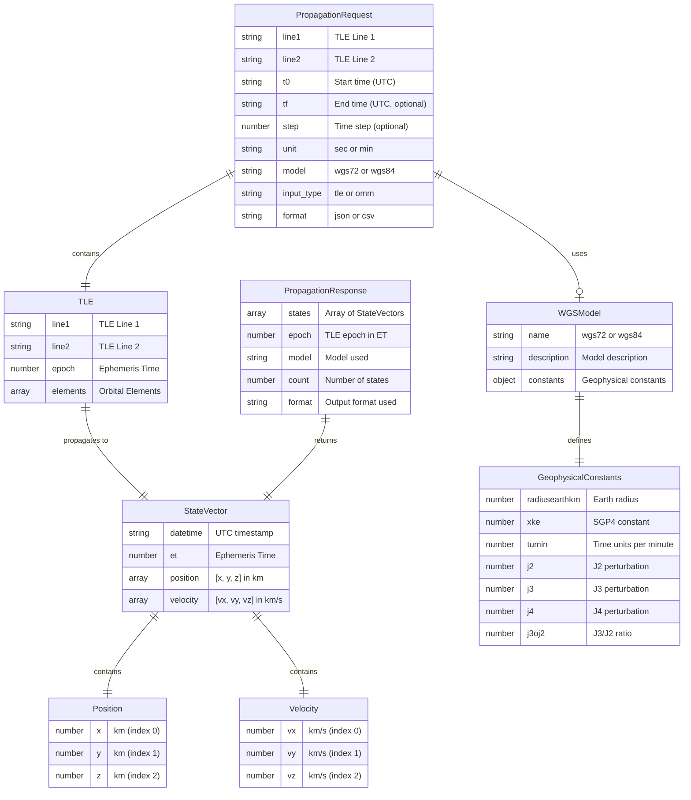
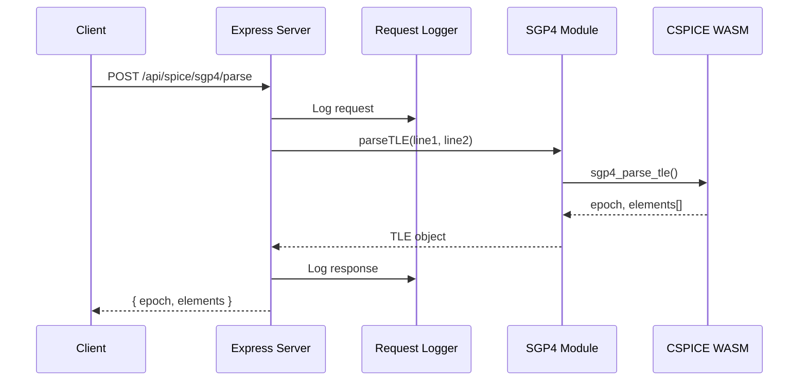
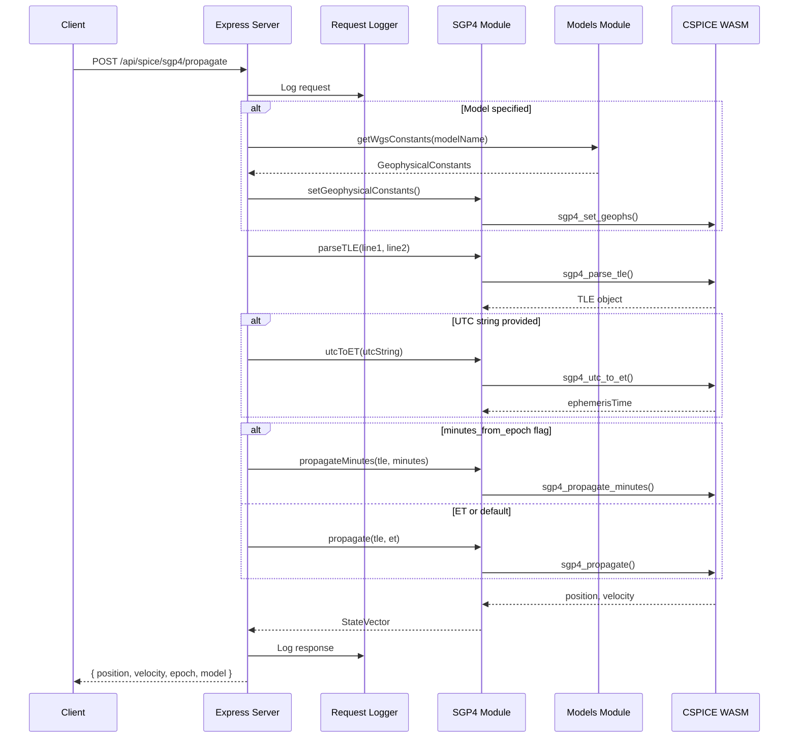
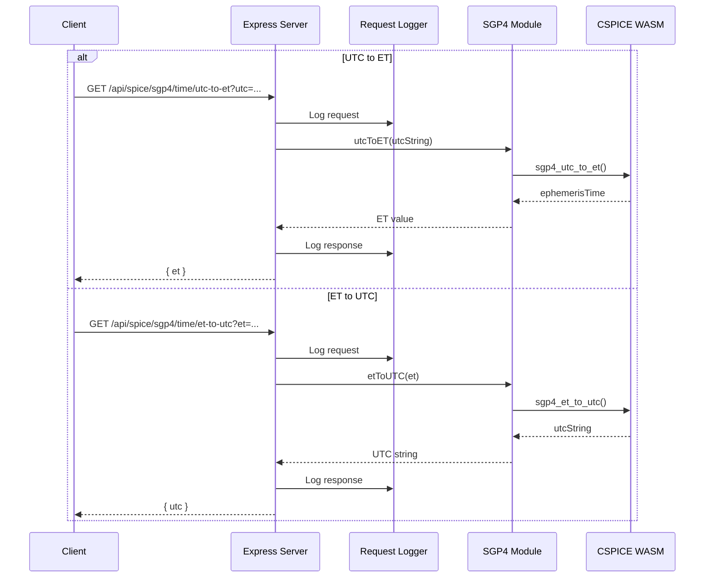
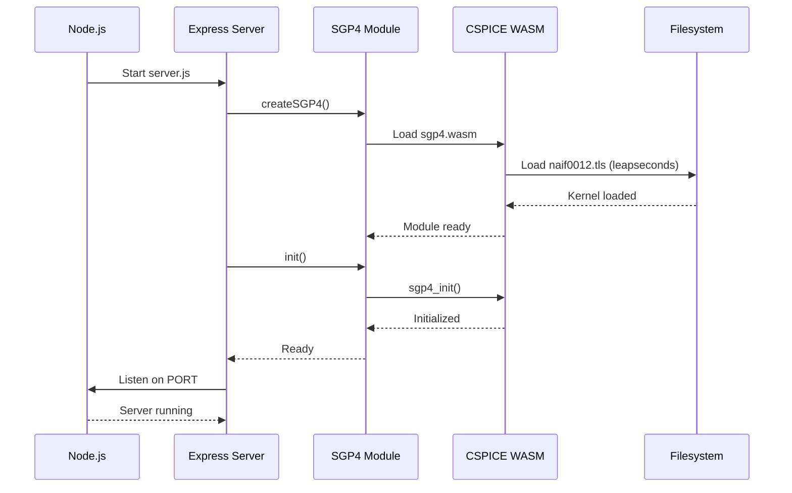
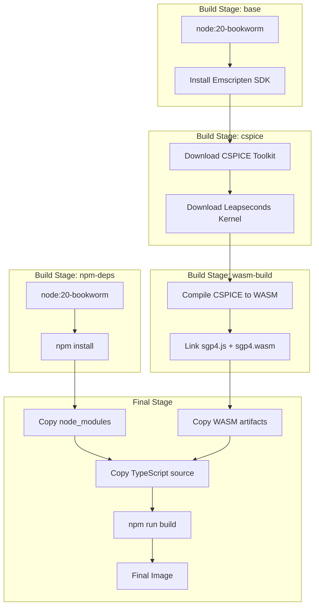

# SPICE SGP4 Architecture

## Overview

SPICE SGP4 is a REST API service that provides satellite orbit propagation using the SGP4 algorithm implemented via NASA/JPL NAIF CSPICE compiled to WebAssembly.

## System Architecture

```
┌─────────────────────────────────────────────────────────────────┐
│                         Client                                  │
│              (Browser, curl, Application)                       │
└─────────────────────────────────────────────────────────────────┘
                              │
                              ▼
┌─────────────────────────────────────────────────────────────────┐
│                    Express.js Server                            │
│  ┌───────────────┐  ┌───────────────┐  ┌───────────────┐       │
│  │ Request Logger│  │  Swagger UI   │  │  API Routes   │       │
│  └───────────────┘  └───────────────┘  └───────────────┘       │
└─────────────────────────────────────────────────────────────────┘
                              │
                              ▼
┌─────────────────────────────────────────────────────────────────┐
│                     SGP4 Module (TypeScript)                    │
│  ┌───────────────┐  ┌───────────────┐  ┌───────────────┐       │
│  │  TLE Parser   │  │  Propagator   │  │ Time Converter│       │
│  └───────────────┘  └───────────────┘  └───────────────┘       │
└─────────────────────────────────────────────────────────────────┘
                              │
                              ▼
┌─────────────────────────────────────────────────────────────────┐
│                    CSPICE WASM Module                           │
│  ┌───────────────┐  ┌───────────────┐  ┌───────────────┐       │
│  │  SGP4 Core    │  │ Leapseconds   │  │  Geophysical  │       │
│  │  Algorithm    │  │   Kernel      │  │   Constants   │       │
│  └───────────────┘  └───────────────┘  └───────────────┘       │
└─────────────────────────────────────────────────────────────────┘
```

## Entity Relationship Diagram



## Sequence Diagrams

### TLE Parse Flow



### TLE Propagation Flow



### Time Conversion Flow



### Server Initialization Flow



## API Endpoints

| Method | Endpoint | Description |
|--------|----------|-------------|
| POST | `/api/spice/sgp4/parse` | Parse TLE and return orbital elements |
| POST | `/api/spice/sgp4/propagate` | Propagate TLE/OMM (supports JSON/CSV output) |
| POST | `/api/spice/sgp4/omm/parse` | Parse OMM JSON and return orbital elements |
| POST | `/api/spice/sgp4/omm/to-tle` | Convert OMM to TLE format |
| POST | `/api/spice/sgp4/tle/to-omm` | Convert TLE to OMM format |
| GET | `/api/spice/sgp4/time/utc-to-et` | Convert UTC to Ephemeris Time |
| GET | `/api/spice/sgp4/time/et-to-utc` | Convert Ephemeris Time to UTC |
| GET | `/api/spice/sgp4/health` | Health check endpoint |
| GET | `/api/models/` | List available geophysical models |
| GET | `/api/models/wgs/:name` | Get specific WGS model details |
| GET | `/api/docs` | Interactive Swagger UI documentation |
| GET | `/api/openapi.json` | OpenAPI specification |

### Propagate Query Parameters

| Parameter | Values | Default | Description |
|-----------|--------|---------|-------------|
| `t0` | UTC string | (required) | Start time |
| `tf` | UTC string | - | End time (for range mode) |
| `step` | number | - | Time step (for range mode) |
| `unit` | `sec`, `min` | `sec` | Step unit |
| `wgs` | `wgs72`, `wgs84` | `wgs72` | Geophysical model |
| `input_type` | `tle`, `omm` | `tle` | Input format |
| `format` | `json`, `csv` | `json` | Output format |

### Output Formats

**JSON format** (default):
```json
{
  "states": [
    {
      "datetime": "2024-01-15T12:00:00.000",
      "et": 758592069.18,
      "position": [-5945.93, -3284.80, 0.29],
      "velocity": [2.31, -4.16, 6.01]
    }
  ],
  "epoch": 758592069.18,
  "model": "wgs72",
  "count": 1
}
```

**CSV format** (`format=csv`):
```
datetime,et,x,y,z,vx,vy,vz
2024-01-15T12:00:00.000,758592069.18,-5945.93,-3284.80,0.29,2.31,-4.16,6.01
```

## Container Architecture



## Data Flow

```
┌──────────┐     ┌──────────┐     ┌──────────┐     ┌──────────┐
│   TLE    │────▶│  Parse   │────▶│ Propagate│────▶│  State   │
│  Input   │     │          │     │          │     │  Vector  │
└──────────┘     └──────────┘     └──────────┘     └──────────┘
                      │                │
                      ▼                ▼
                ┌──────────┐     ┌──────────┐
                │  Epoch   │     │   WGS    │
                │   (ET)   │     │  Model   │
                └──────────┘     └──────────┘
```
